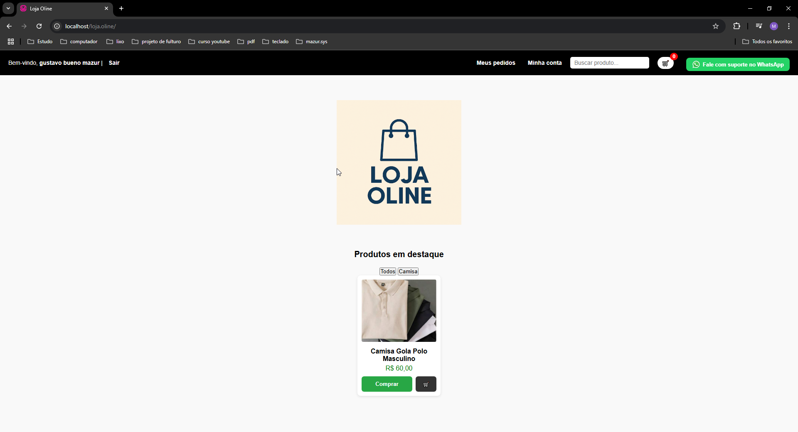
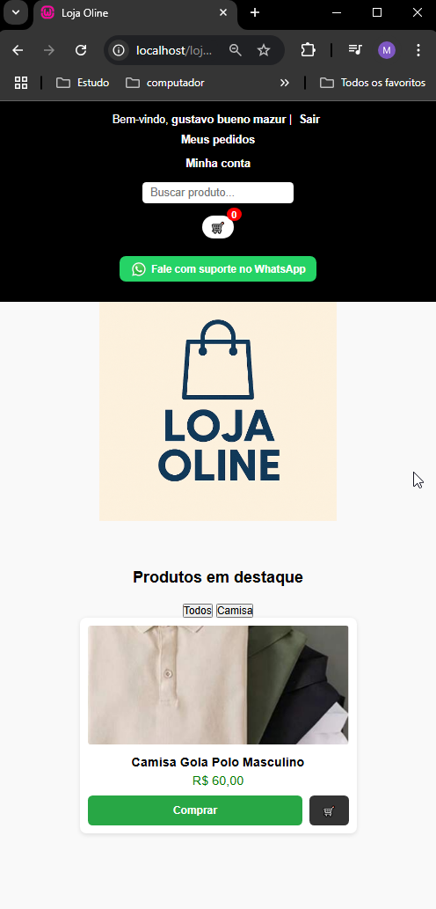
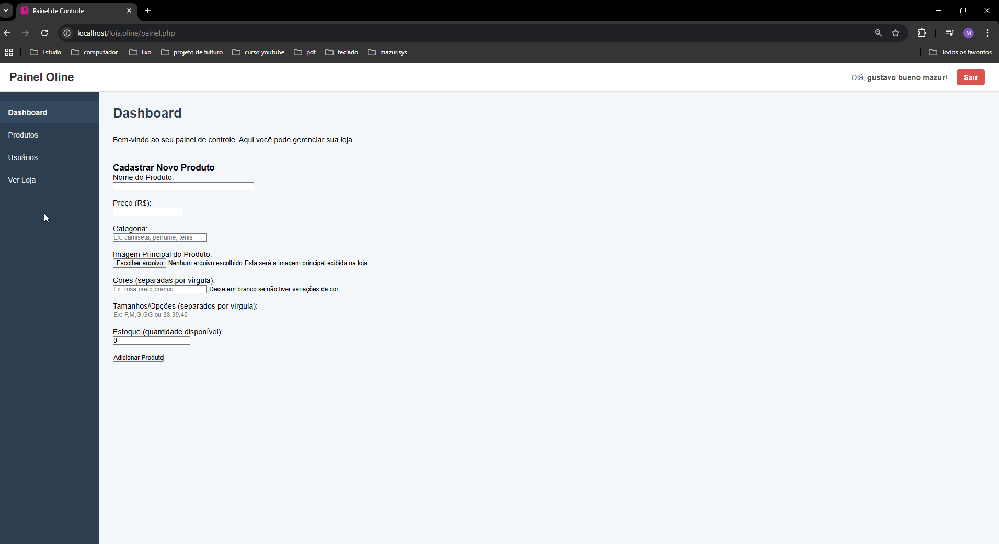
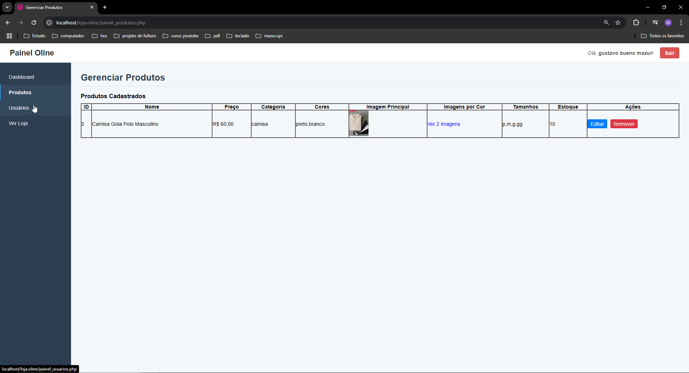
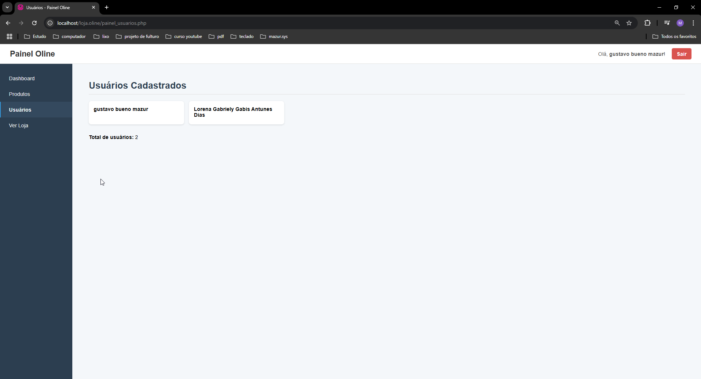

# Loja Online com Painel Administrativo

Descrição:
Projeto de loja virtual com painel administrativo completo, originalmente desenvolvido em PHP e MySQL, que agora está sendo transformado em uma plataforma colaborativa open source.
O objetivo é evoluir o sistema, adicionando tecnologias modernas de Java (back-end), banco de dados relacional e melhorias no front-end responsivo, enquanto criamos uma comunidade de aprendizado e desenvolvimento em equipe.

Objetivo do Projeto

- Montar um time de desenvolvedores juniores (ou estudantes) interessados em:
- Aprender trabalho em equipe e versionamento com Git/GitHub
- Desenvolver funcionalidades reais com Java + MySQL + Front-end (HTML, CSS, JS)
- Compartilhar ideias, fazer network e evoluir juntos
- Criar um projeto completo e profissional para o portfólio e LinkedIn
- O foco não é só código — é aprender, se ajudar e se divertir no processo 😄

---

## Demonstrações

### Painel do Cliente (Desktop)

### Painel do Cliente (Mobile)

### Painel do Dono da Loja

### Visualização de Produtos

### Gerenciamento de Usuários

---

## Funcionalidades

- Cadastro de produtos com imagem principal e múltiplas imagens por cor (JSON).
- Controle de estoque, tamanhos e cores.
- Gerenciamento de usuários.
- Login com autenticação por sessão.
- Painel administrativo separado do painel do cliente.
- Layout responsivo para desktop e mobile.

---

Estrutura básica
loja.oline/
- ├── painel.php
- ├── painel_produtos.php
- ├── painel_usuarios.php
- ├── cadastro.php
- ├── login.php
- ├── index.php
- ├── conexao.php
- ├── processa_produto.php
- ├── style.css
- ├── painel.css
- ├── screenshots/        
- │   ├── Cliente.png
- │   ├── Cliente-mobile.png
- │   ├── Painel-dono.png
- │   ├── Produtos.png
- │   └── Usuarios.png

Tecnologias Atuais
-PHP
-MySQL
-HTML5
-CSS3
-JavaScript

Autor
Gustavo-Bueno-Mazur

🔗LinkedIn
https://www.linkedin.com/in/gustavo-bueno-mazur/

